# SoliDrop — Data Flow 詳細設計書

対象読者: 実装/改修を担当するエンジニア
前提知識: `docs/design/architecture.md` のシステム概要を把握していること

---

## 1. システム全体のデータフロー概観

### 1.1 コンポーネントとデータ経路

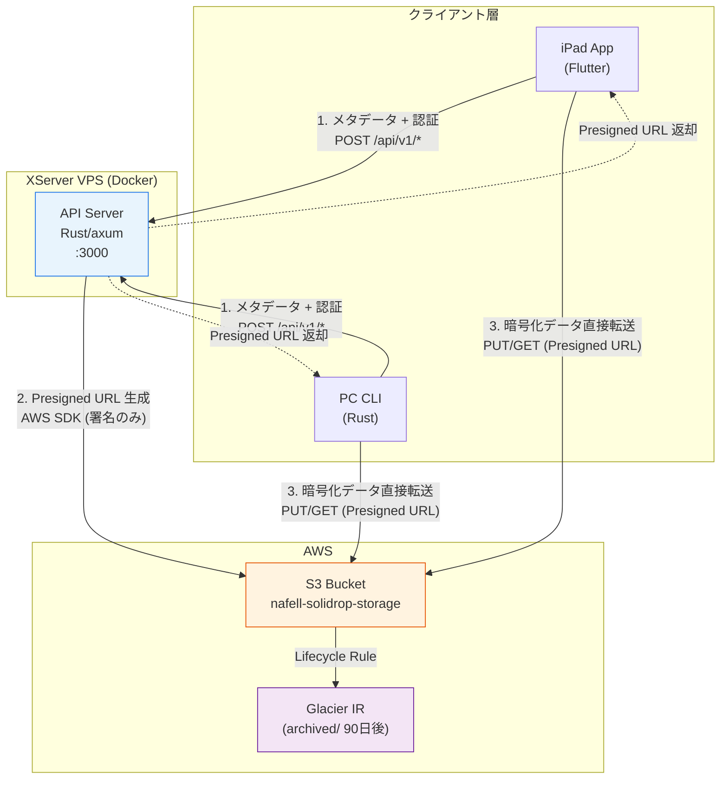
```mermaid
graph TB
    subgraph Clients["クライアント層"]
        iPad["iPad App<br/>(Flutter)"]
        PC["PC CLI<br/>(Rust)"]
    end

    subgraph VPS["XServer VPS (Docker)"]
        API["API Server<br/>Rust/axum<br/>:3000"]
    end

    subgraph AWS["AWS"]
        S3["S3 Bucket<br/>nafell-solidrop-storage"]
        Glacier["Glacier IR<br/>(archived/ 90日後)"]
    end

    iPad -- "1. メタデータ + 認証<br/>POST /api/v1/*" --> API
    PC -- "1. メタデータ + 認証<br/>POST /api/v1/*" --> API
    API -- "2. Presigned URL 生成<br/>AWS SDK (署名のみ)" --> S3
    API -. "Presigned URL 返却" .-> iPad
    API -. "Presigned URL 返却" .-> PC
    iPad -- "3. 暗号化データ直接転送<br/>PUT/GET (Presigned URL)" --> S3
    PC -- "3. 暗号化データ直接転送<br/>PUT/GET (Presigned URL)" --> S3
    S3 -- "Lifecycle Rule" --> Glacier

    style API fill:#e8f4fd,stroke:#1a73e8
    style S3 fill:#fff3e0,stroke:#e65100
    style Glacier fill:#f3e5f5,stroke:#6a1b9a
```

**設計原則: API Server はコントロールプレーン専用。** ファイルデータは API Server を経由せず、クライアントと S3 の間を直接流れる。API Server が扱うのは認証、URL生成、メタデータ操作のみ。

### 1.2 S3 バケット構造とデータライフサイクル

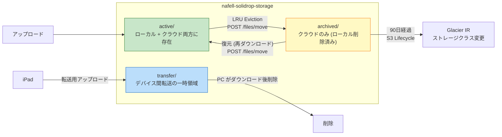
```mermaid
graph LR
    subgraph Bucket["nafell-solidrop-storage"]
        Active["active/<br/>ローカル + クラウド両方に存在"]
        Archived["archived/<br/>クラウドのみ (ローカル削除済み)"]
        Transfer["transfer/<br/>デバイス間転送の一時領域"]
    end

    Upload["アップロード"] --> Active
    Active -- "LRU Eviction<br/>POST /files/move" --> Archived
    Archived -- "復元 (再ダウンロード)<br/>POST /files/move" --> Active
    iPad2["iPad"] -- "転送用アップロード" --> Transfer
    Transfer -- "PC がダウンロード後削除" --> Deleted["削除"]
    Archived -- "90日経過<br/>S3 Lifecycle" --> Glacier2["Glacier IR<br/>ストレージクラス変更"]

    style Active fill:#c8e6c9,stroke:#2e7d32
    style Archived fill:#fff9c4,stroke:#f57f17
    style Transfer fill:#bbdefb,stroke:#1565c0
```

---

## 2. 認証ミドルウェアチェーン

すべての `/api/v1/*` エンドポイントに適用される。`/health` のみ認証不要。

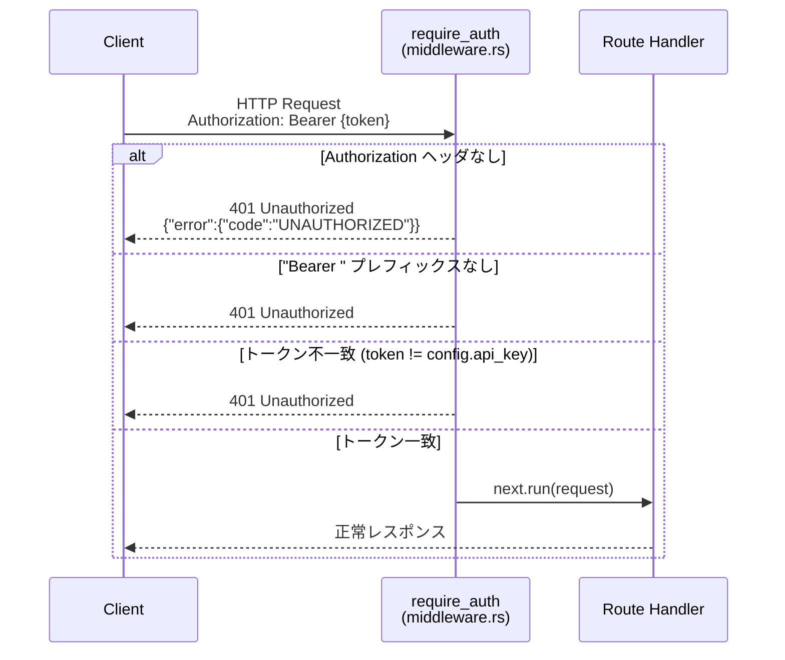
```mermaid
sequenceDiagram
    participant C as Client
    participant MW as require_auth<br/>(middleware.rs)
    participant H as Route Handler

    C->>MW: HTTP Request<br/>Authorization: Bearer {token}

    alt Authorization ヘッダなし
        MW-->>C: 401 Unauthorized<br/>{"error":{"code":"UNAUTHORIZED"}}
    else "Bearer " プレフィックスなし
        MW-->>C: 401 Unauthorized
    else トークン不一致 (token != config.api_key)
        MW-->>C: 401 Unauthorized
    else トークン一致
        MW->>H: next.run(request)
        H-->>C: 正常レスポンス
    end
```

**実装箇所:** `crates/api-server/src/middleware.rs` — `require_auth()`
**適用箇所:** `crates/api-server/src/routes/mod.rs:32-43` — `route_layer(from_fn_with_state(...))`

---

## 3. エンドポイント別データフロー

### 3.1 POST /api/v1/presign/upload — Presigned Upload URL 発行

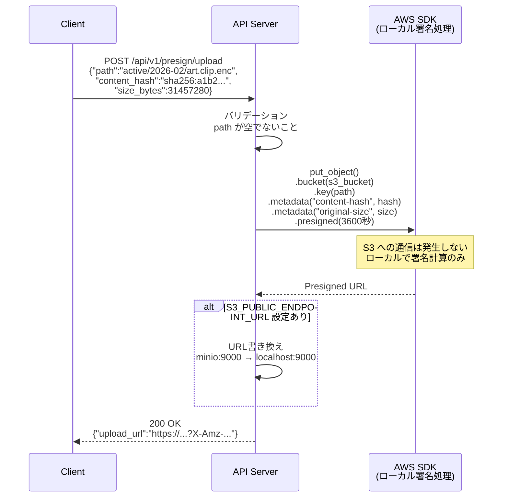
```mermaid
sequenceDiagram
    participant C as Client
    participant API as API Server
    participant SDK as AWS SDK<br/>(ローカル署名処理)

    C->>API: POST /api/v1/presign/upload<br/>{"path":"active/2026-02/art.clip.enc",<br/> "content_hash":"sha256:a1b2...",<br/> "size_bytes":31457280}

    API->>API: バリデーション<br/>path が空でないこと

    API->>SDK: put_object()<br/>.bucket(s3_bucket)<br/>.key(path)<br/>.metadata("content-hash", hash)<br/>.metadata("original-size", size)<br/>.presigned(3600秒)

    Note over SDK: S3 への通信は発生しない<br/>ローカルで署名計算のみ

    SDK-->>API: Presigned URL

    alt S3_PUBLIC_ENDPOINT_URL 設定あり
        API->>API: URL書き換え<br/>minio:9000 → localhost:9000
    end

    API-->>C: 200 OK<br/>{"upload_url":"https://...?X-Amz-..."}
```

**Presigned URL に埋め込まれるメタデータ:**
- `x-amz-meta-content-hash` — 平文の SHA-256 ハッシュ (整合性検証・重複排除用)
- `x-amz-meta-original-size` — 暗号化前のファイルサイズ

これらは S3 PUT 時にオブジェクトメタデータとして自動保存される。

**実装箇所:** `crates/api-server/src/routes/presign.rs:37-62` — `presign_upload()`

### 3.2 POST /api/v1/presign/download — Presigned Download URL 発行

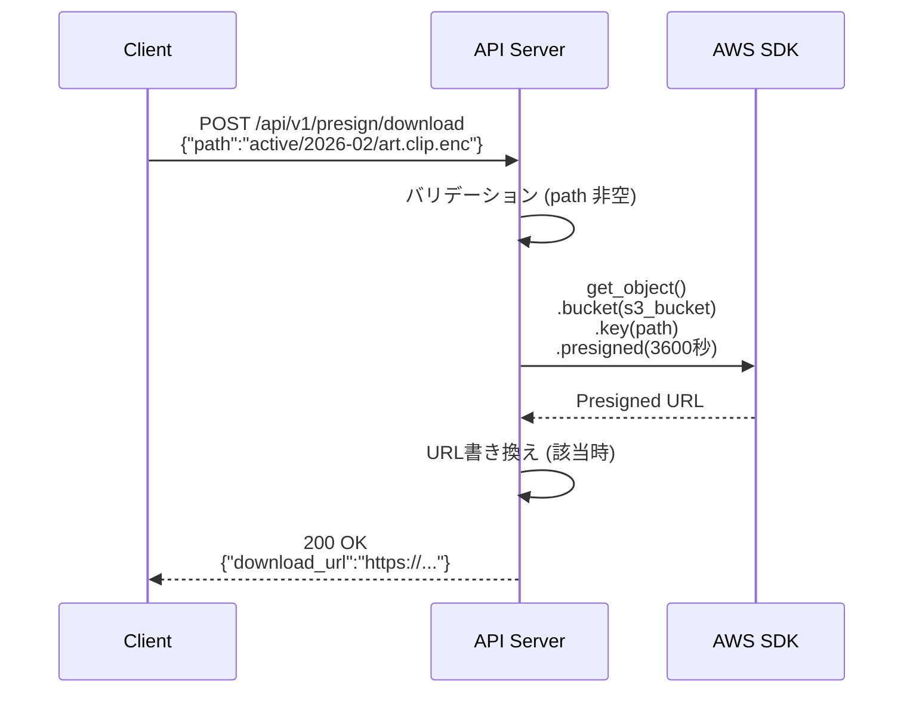
```mermaid
sequenceDiagram
    participant C as Client
    participant API as API Server
    participant SDK as AWS SDK

    C->>API: POST /api/v1/presign/download<br/>{"path":"active/2026-02/art.clip.enc"}

    API->>API: バリデーション (path 非空)

    API->>SDK: get_object()<br/>.bucket(s3_bucket)<br/>.key(path)<br/>.presigned(3600秒)

    SDK-->>API: Presigned URL

    API->>API: URL書き換え (該当時)

    API-->>C: 200 OK<br/>{"download_url":"https://..."}
```

**実装箇所:** `crates/api-server/src/routes/presign.rs:64-87` — `presign_download()`

### 3.3 GET /api/v1/files — ファイル一覧取得

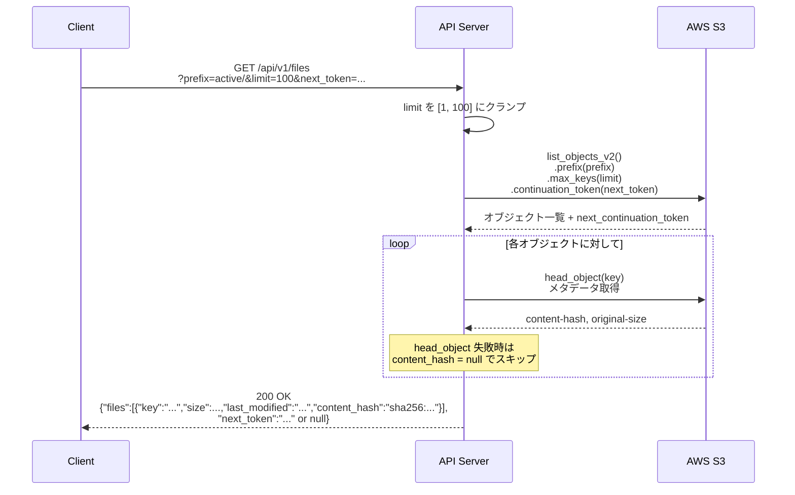
```mermaid
sequenceDiagram
    participant C as Client
    participant API as API Server
    participant S3 as AWS S3

    C->>API: GET /api/v1/files<br/>?prefix=active/&limit=100&next_token=...

    API->>API: limit を [1, 100] にクランプ

    API->>S3: list_objects_v2()<br/>.prefix(prefix)<br/>.max_keys(limit)<br/>.continuation_token(next_token)
    S3-->>API: オブジェクト一覧 + next_continuation_token

    loop 各オブジェクトに対して
        API->>S3: head_object(key)<br/>メタデータ取得
        S3-->>API: content-hash, original-size
        Note over API: head_object 失敗時は<br/>content_hash = null でスキップ
    end

    API-->>C: 200 OK<br/>{"files":[{"key":"...","size":...,"last_modified":"...","content_hash":"sha256:..."}],<br/> "next_token":"..." or null}
```

**N+1 クエリパターン:** 1回の `list_objects_v2` + N回の `head_object`。100件一覧で101回のS3 APIコール。将来的にメタデータキャッシュや一括取得の最適化余地あり。

**実装箇所:** `crates/api-server/src/routes/files.rs`

### 3.4 DELETE /api/v1/files/*path — ファイル削除

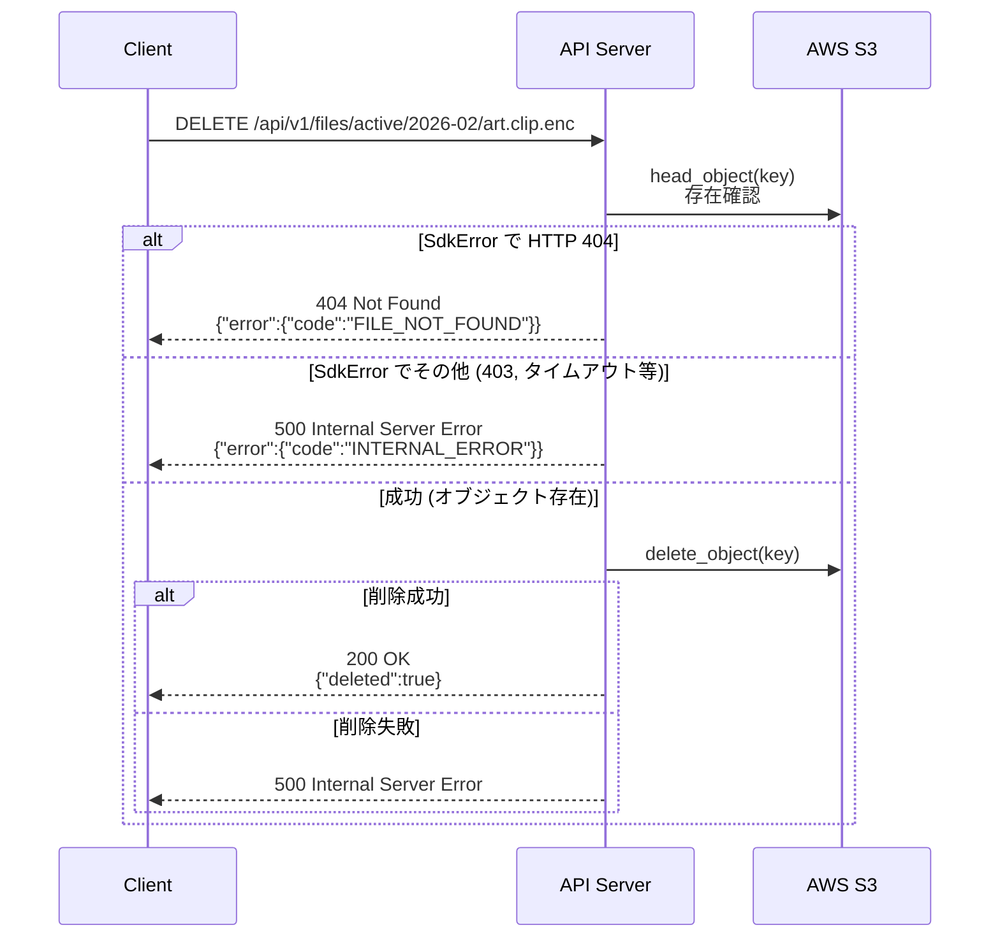
```mermaid
sequenceDiagram
    participant C as Client
    participant API as API Server
    participant S3 as AWS S3

    C->>API: DELETE /api/v1/files/active/2026-02/art.clip.enc

    API->>S3: head_object(key)<br/>存在確認

    alt SdkError で HTTP 404
        API-->>C: 404 Not Found<br/>{"error":{"code":"FILE_NOT_FOUND"}}
    else SdkError でその他 (403, タイムアウト等)
        API-->>C: 500 Internal Server Error<br/>{"error":{"code":"INTERNAL_ERROR"}}
    else 成功 (オブジェクト存在)
        API->>S3: delete_object(key)
        alt 削除成功
            API-->>C: 200 OK<br/>{"deleted":true}
        else 削除失敗
            API-->>C: 500 Internal Server Error
        end
    end
```

**S3エラー分類ロジック:**
```rust
fn is_not_found<E>(err: &SdkError<E>) -> bool {
    matches!(err, SdkError::ServiceError(e) if e.raw().status().as_u16() == 404)
}
```
`SdkError::ServiceError` 以外（`DispatchFailure`, `TimeoutError` 等）は全て Internal にフォールスルーする。

**実装箇所:** `crates/api-server/src/routes/delete.rs`

### 3.5 POST /api/v1/files/move — ファイル移動 (Best-Effort)

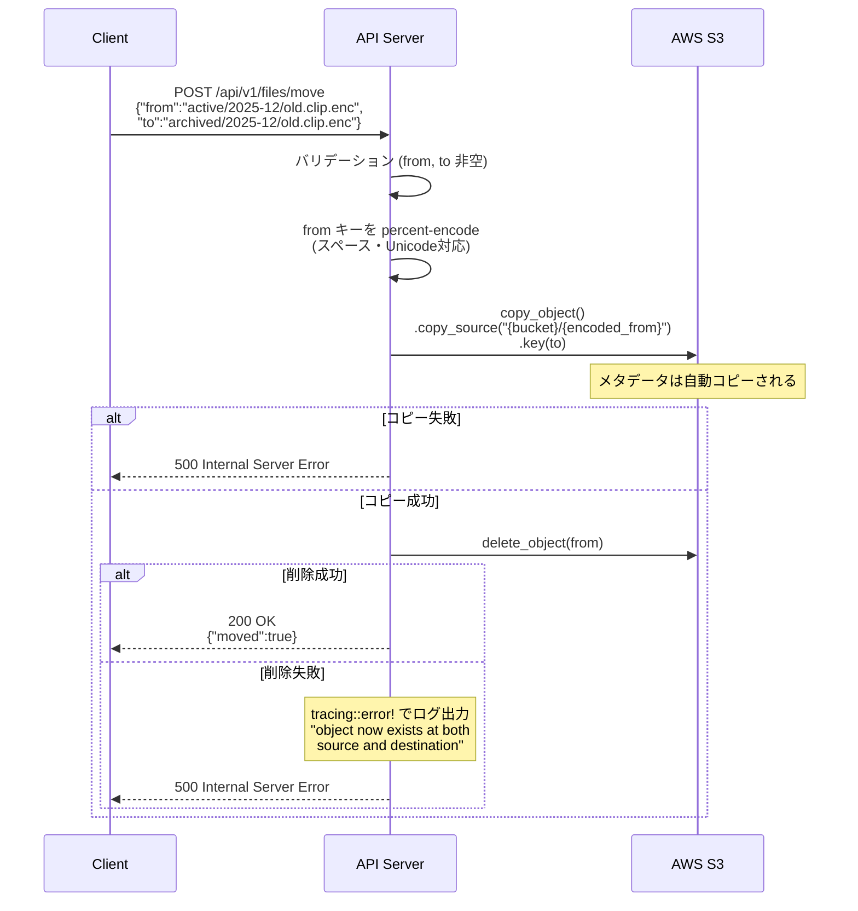
```mermaid
sequenceDiagram
    participant C as Client
    participant API as API Server
    participant S3 as AWS S3

    C->>API: POST /api/v1/files/move<br/>{"from":"active/2025-12/old.clip.enc",<br/> "to":"archived/2025-12/old.clip.enc"}

    API->>API: バリデーション (from, to 非空)
    API->>API: from キーを percent-encode<br/>(スペース・Unicode対応)

    API->>S3: copy_object()<br/>.copy_source("{bucket}/{encoded_from}")<br/>.key(to)
    Note over S3: メタデータは自動コピーされる

    alt コピー失敗
        API-->>C: 500 Internal Server Error
    else コピー成功
        API->>S3: delete_object(from)
        alt 削除成功
            API-->>C: 200 OK<br/>{"moved":true}
        else 削除失敗
            Note over API: tracing::error! でログ出力<br/>"object now exists at both<br/>source and destination"
            API-->>C: 500 Internal Server Error
        end
    end
```

**Best-Effort Move の状態遷移:**

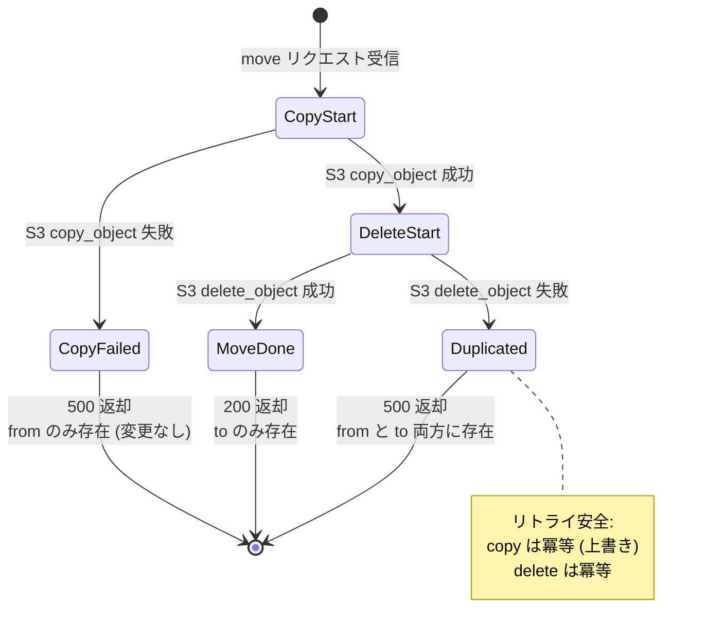
```mermaid
stateDiagram-v2
    [*] --> CopyStart: move リクエスト受信
    CopyStart --> CopyFailed: S3 copy_object 失敗
    CopyStart --> DeleteStart: S3 copy_object 成功
    DeleteStart --> MoveDone: S3 delete_object 成功
    DeleteStart --> Duplicated: S3 delete_object 失敗

    CopyFailed --> [*]: 500 返却<br/>from のみ存在 (変更なし)
    MoveDone --> [*]: 200 返却<br/>to のみ存在
    Duplicated --> [*]: 500 返却<br/>from と to 両方に存在

    note right of Duplicated
        リトライ安全:
        copy は冪等 (上書き)
        delete は冪等
    end note
```

**URL エンコード対象文字:**

| 文字種 | エンコード | 例 |
|---|---|---|
| 英数字 | しない | `a-z`, `0-9` |
| `/` `-` `_` `.` `~` | しない | S3パス区切り + RFC 3986 非予約文字 |
| スペース | する | `%20` |
| Unicode | する | `%E3%82%A2` |
| `(` `)` 等記号 | する | `%28` `%29` |

**実装箇所:** `crates/api-server/src/routes/file_move.rs`

### 3.6 POST /api/v1/cache/report — LRU キャッシュ立退き候補算出

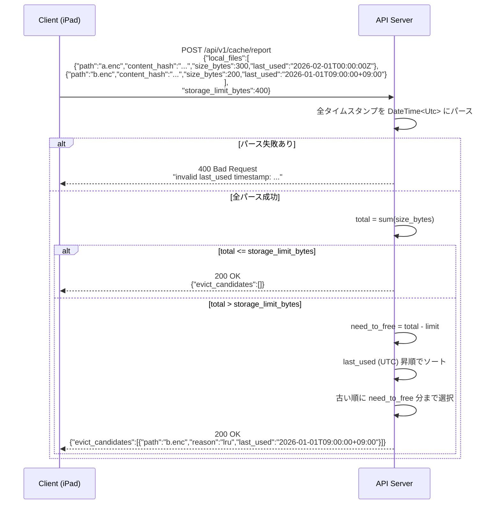
```mermaid
sequenceDiagram
    participant C as Client (iPad)
    participant API as API Server

    C->>API: POST /api/v1/cache/report<br/>{"local_files":[<br/>  {"path":"a.enc","content_hash":"...","size_bytes":300,"last_used":"2026-02-01T00:00:00Z"},<br/>  {"path":"b.enc","content_hash":"...","size_bytes":200,"last_used":"2026-01-01T09:00:00+09:00"}<br/>],<br/>"storage_limit_bytes":400}

    API->>API: 全タイムスタンプを DateTime<Utc> にパース

    alt パース失敗あり
        API-->>C: 400 Bad Request<br/>"invalid last_used timestamp: ..."
    else 全パース成功
        API->>API: total = sum(size_bytes)

        alt total <= storage_limit_bytes
            API-->>C: 200 OK<br/>{"evict_candidates":[]}
        else total > storage_limit_bytes
            API->>API: need_to_free = total - limit
            API->>API: last_used (UTC) 昇順でソート
            API->>API: 古い順に need_to_free 分まで選択
            API-->>C: 200 OK<br/>{"evict_candidates":[{"path":"b.enc","reason":"lru","last_used":"2026-01-01T09:00:00+09:00"}]}
        end
    end
```

**タイムスタンプパース戦略:**
1. まず `DateTime<FixedOffset>` としてパース（`+09:00` 等のオフセット付き対応）
2. 失敗時は `DateTime<Utc>` としてパース（`Z` サフィックス対応）
3. 両方失敗 → 400 エラー

パース後は全て UTC に正規化し、chronological order でソートする。

**S3 APIコール: なし** (純粋な計算処理)

**実装箇所:** `crates/api-server/src/routes/cache.rs`

---

## 4. 暗号化パイプライン

### 4.1 鍵階層

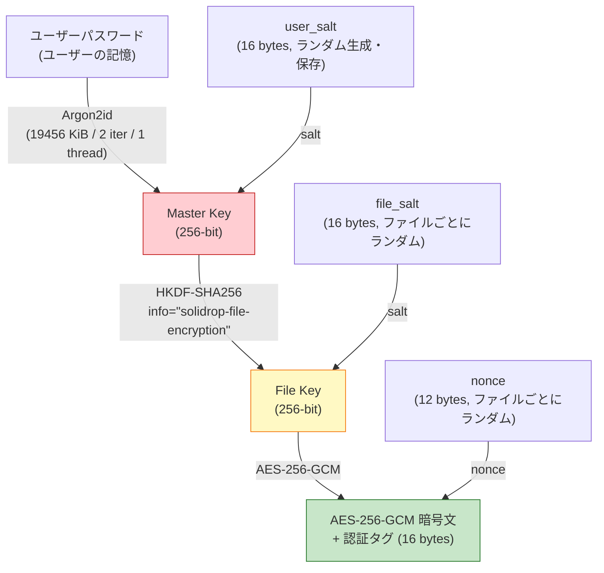
```mermaid
graph TD
    PW["ユーザーパスワード<br/>(ユーザーの記憶)"]
    US["user_salt<br/>(16 bytes, ランダム生成・保存)"]
    MK["Master Key<br/>(256-bit)"]
    FS["file_salt<br/>(16 bytes, ファイルごとにランダム)"]
    FK["File Key<br/>(256-bit)"]
    NC["nonce<br/>(12 bytes, ファイルごとにランダム)"]
    CT["AES-256-GCM 暗号文<br/>+ 認証タグ (16 bytes)"]

    PW -->|"Argon2id<br/>(19456 KiB / 2 iter / 1 thread)"| MK
    US -->|"salt"| MK
    MK -->|"HKDF-SHA256<br/>info=&quot;solidrop-file-encryption&quot;"| FK
    FS -->|"salt"| FK
    FK -->|"AES-256-GCM"| CT
    NC -->|"nonce"| CT

    style MK fill:#ffcdd2,stroke:#c62828
    style FK fill:#fff9c4,stroke:#f57f17
    style CT fill:#c8e6c9,stroke:#2e7d32
```

**Master Key 保管場所:**
- iPad: iOS Keychain
- PC: OS 資格情報ストア (`keychain_service` / `keychain_account` で設定)
- **サーバー・クラウドには一切送信しない**

### 4.2 暗号化フロー (encrypt)

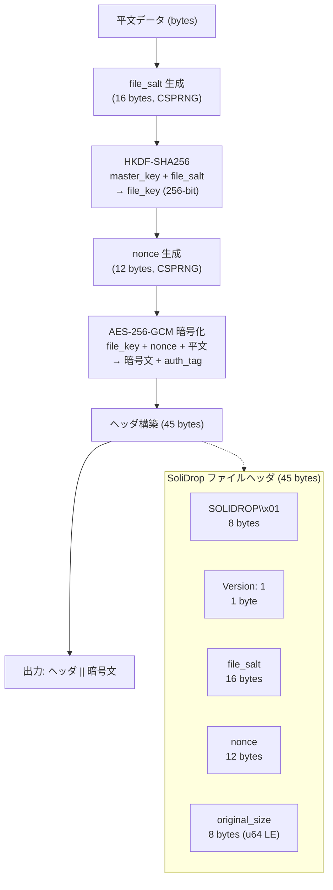
```mermaid
flowchart TD
    Start["平文データ (bytes)"] --> GenSalt["file_salt 生成<br/>(16 bytes, CSPRNG)"]
    GenSalt --> DeriveKey["HKDF-SHA256<br/>master_key + file_salt<br/>→ file_key (256-bit)"]
    DeriveKey --> GenNonce["nonce 生成<br/>(12 bytes, CSPRNG)"]
    GenNonce --> Encrypt["AES-256-GCM 暗号化<br/>file_key + nonce + 平文<br/>→ 暗号文 + auth_tag"]
    Encrypt --> BuildHeader["ヘッダ構築 (45 bytes)"]
    BuildHeader --> Output["出力: ヘッダ || 暗号文"]

    subgraph Header["SoliDrop ファイルヘッダ (45 bytes)"]
        direction LR
        Magic["SOLIDROP\\x01<br/>8 bytes"]
        Version["Version: 1<br/>1 byte"]
        Salt["file_salt<br/>16 bytes"]
        Nonce["nonce<br/>12 bytes"]
        OrigSize["original_size<br/>8 bytes (u64 LE)"]
    end

    BuildHeader -.-> Header
```

**実装箇所:** `crates/crypto/src/encrypt.rs` — `encrypt()`

### 4.3 復号フロー (decrypt)

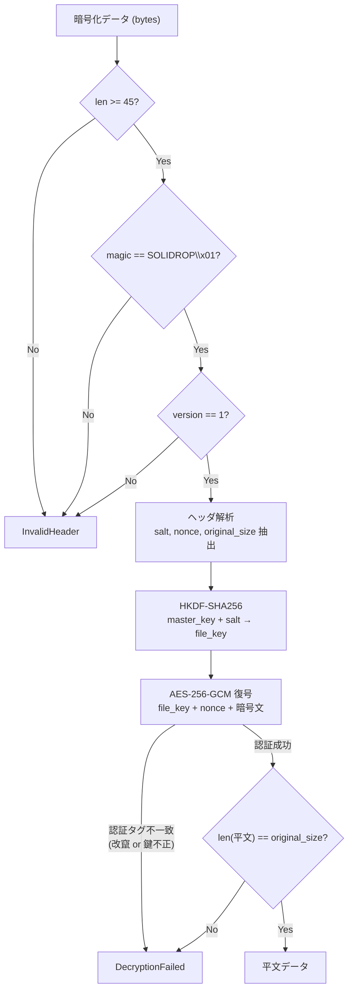
```mermaid
flowchart TD
    Input["暗号化データ (bytes)"] --> CheckLen{"len >= 45?"}
    CheckLen -->|No| ErrHeader["InvalidHeader"]
    CheckLen -->|Yes| CheckMagic{"magic == SOLIDROP\\x01?"}
    CheckMagic -->|No| ErrHeader
    CheckMagic -->|Yes| CheckVer{"version == 1?"}
    CheckVer -->|No| ErrHeader
    CheckVer -->|Yes| Parse["ヘッダ解析<br/>salt, nonce, original_size 抽出"]
    Parse --> DeriveKey["HKDF-SHA256<br/>master_key + salt → file_key"]
    DeriveKey --> Decrypt["AES-256-GCM 復号<br/>file_key + nonce + 暗号文"]
    Decrypt -->|"認証タグ不一致<br/>(改竄 or 鍵不正)"| ErrDecrypt["DecryptionFailed"]
    Decrypt -->|"認証成功"| CheckSize{"len(平文) == original_size?"}
    CheckSize -->|No| ErrDecrypt
    CheckSize -->|Yes| Output["平文データ"]
```

**実装箇所:** `crates/crypto/src/decrypt.rs` — `decrypt()`

### 4.4 ハッシュ計算

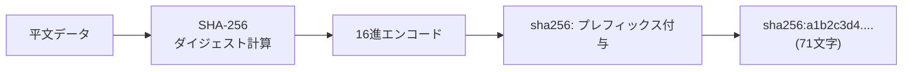
```mermaid
flowchart LR
    Data["平文データ"] --> SHA["SHA-256<br/>ダイジェスト計算"]
    SHA --> Hex["16進エンコード"]
    Hex --> Prefix["sha256: プレフィックス付与"]
    Prefix --> Hash["sha256:a1b2c3d4....<br/>(71文字)"]
```

用途:
- **アップロード時:** 平文ハッシュを S3 メタデータとして保存
- **ダウンロード後:** 復号した平文のハッシュとメタデータを照合 → 整合性検証
- **重複排除 (将来):** 同一ハッシュのファイルはアップロードをスキップ

**実装箇所:** `crates/crypto/src/hash.rs` — `sha256_hex()`, `verify_hash()`

---

## 5. エンドツーエンドフロー

### 5.1 ファイルアップロード (クライアント → S3)

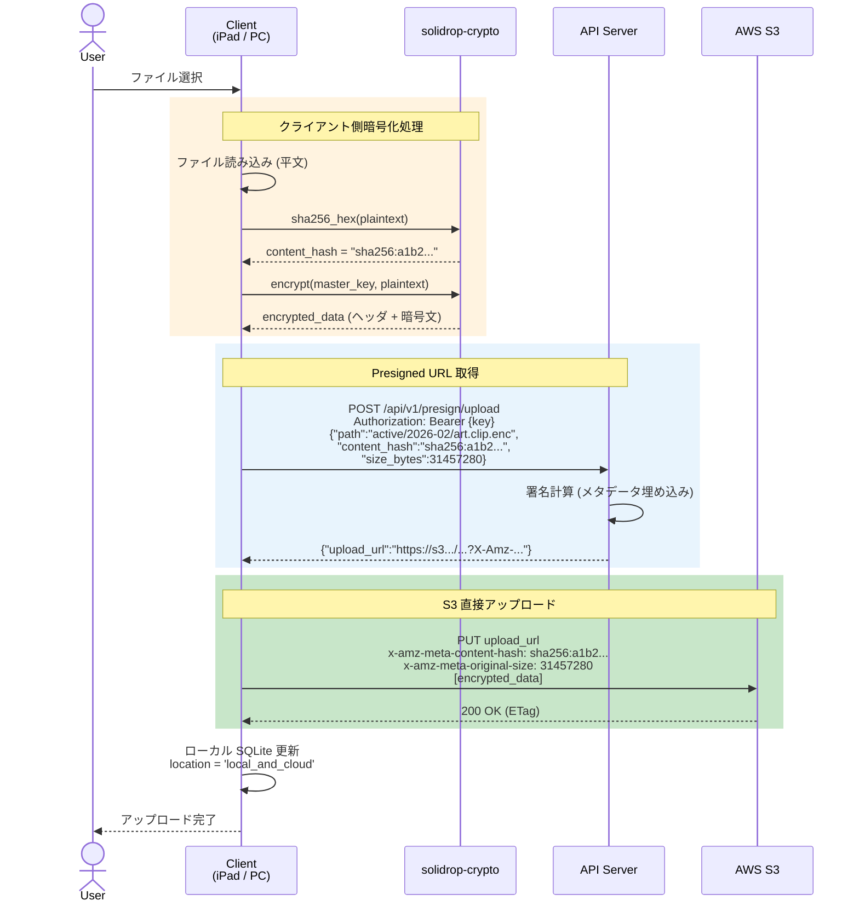
```mermaid
sequenceDiagram
    actor User
    participant Client as Client<br/>(iPad / PC)
    participant Crypto as solidrop-crypto
    participant API as API Server
    participant S3 as AWS S3

    User->>Client: ファイル選択

    rect rgb(255, 243, 224)
        Note over Client,Crypto: クライアント側暗号化処理
        Client->>Client: ファイル読み込み (平文)
        Client->>Crypto: sha256_hex(plaintext)
        Crypto-->>Client: content_hash = "sha256:a1b2..."
        Client->>Crypto: encrypt(master_key, plaintext)
        Crypto-->>Client: encrypted_data (ヘッダ + 暗号文)
    end

    rect rgb(232, 244, 253)
        Note over Client,API: Presigned URL 取得
        Client->>API: POST /api/v1/presign/upload<br/>Authorization: Bearer {key}<br/>{"path":"active/2026-02/art.clip.enc",<br/> "content_hash":"sha256:a1b2...",<br/> "size_bytes":31457280}
        API->>API: 署名計算 (メタデータ埋め込み)
        API-->>Client: {"upload_url":"https://s3.../...?X-Amz-..."}
    end

    rect rgb(200, 230, 201)
        Note over Client,S3: S3 直接アップロード
        Client->>S3: PUT upload_url<br/>x-amz-meta-content-hash: sha256:a1b2...<br/>x-amz-meta-original-size: 31457280<br/>[encrypted_data]
        S3-->>Client: 200 OK (ETag)
    end

    Client->>Client: ローカル SQLite 更新<br/>location = 'local_and_cloud'
    Client-->>User: アップロード完了
```

**データが API Server を通過しないポイント:** ステップ3 (緑色) でクライアントは S3 と直接通信する。API Server は URL 発行のみ。

### 5.2 ファイルダウンロード (S3 → クライアント)

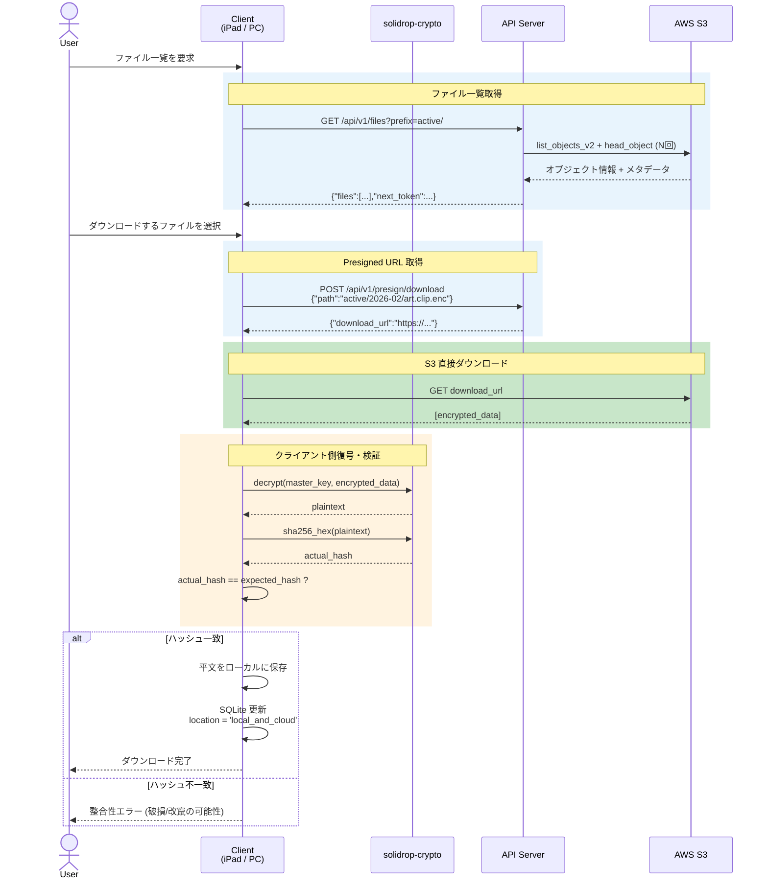
```mermaid
sequenceDiagram
    actor User
    participant Client as Client<br/>(iPad / PC)
    participant Crypto as solidrop-crypto
    participant API as API Server
    participant S3 as AWS S3

    User->>Client: ファイル一覧を要求

    rect rgb(232, 244, 253)
        Note over Client,S3: ファイル一覧取得
        Client->>API: GET /api/v1/files?prefix=active/
        API->>S3: list_objects_v2 + head_object (N回)
        S3-->>API: オブジェクト情報 + メタデータ
        API-->>Client: {"files":[...],"next_token":...}
    end

    User->>Client: ダウンロードするファイルを選択

    rect rgb(232, 244, 253)
        Note over Client,API: Presigned URL 取得
        Client->>API: POST /api/v1/presign/download<br/>{"path":"active/2026-02/art.clip.enc"}
        API-->>Client: {"download_url":"https://..."}
    end

    rect rgb(200, 230, 201)
        Note over Client,S3: S3 直接ダウンロード
        Client->>S3: GET download_url
        S3-->>Client: [encrypted_data]
    end

    rect rgb(255, 243, 224)
        Note over Client,Crypto: クライアント側復号・検証
        Client->>Crypto: decrypt(master_key, encrypted_data)
        Crypto-->>Client: plaintext
        Client->>Crypto: sha256_hex(plaintext)
        Crypto-->>Client: actual_hash
        Client->>Client: actual_hash == expected_hash ?
    end

    alt ハッシュ一致
        Client->>Client: 平文をローカルに保存
        Client->>Client: SQLite 更新<br/>location = 'local_and_cloud'
        Client-->>User: ダウンロード完了
    else ハッシュ不一致
        Client-->>User: 整合性エラー (破損/改竄の可能性)
    end
```

### 5.3 LRU キャッシュ立退きフロー (iPad)

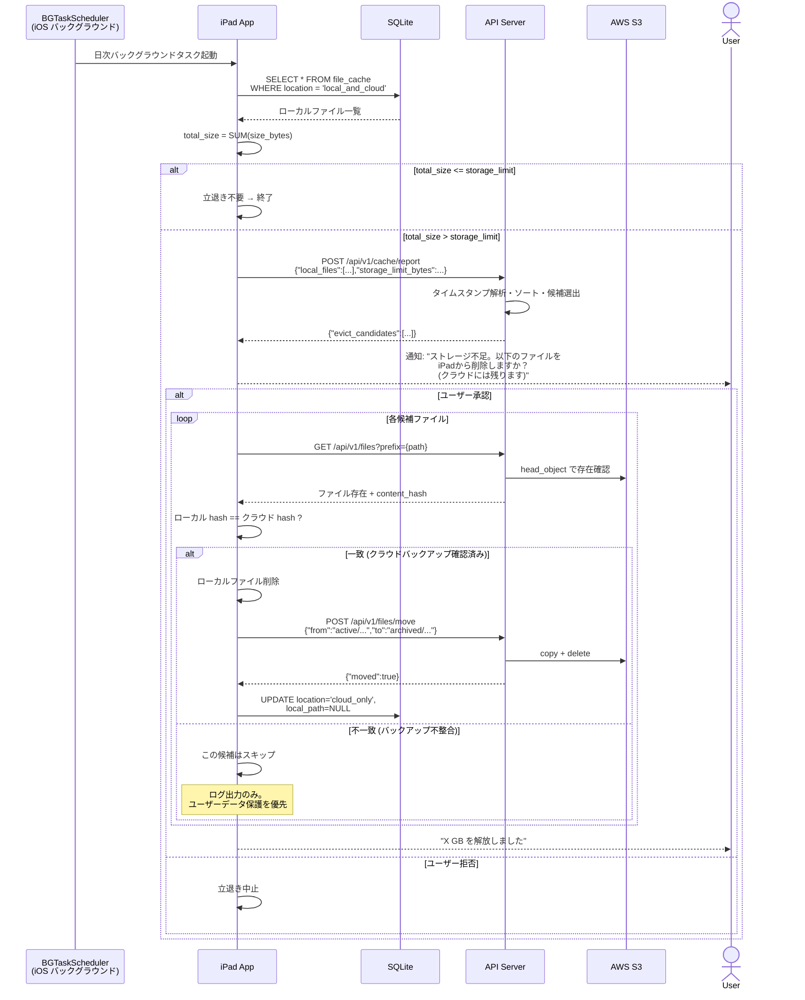
```mermaid
sequenceDiagram
    participant BG as BGTaskScheduler<br/>(iOS バックグラウンド)
    participant App as iPad App
    participant DB as SQLite
    participant API as API Server
    participant S3 as AWS S3
    actor User

    BG->>App: 日次バックグラウンドタスク起動

    App->>DB: SELECT * FROM file_cache<br/>WHERE location = 'local_and_cloud'
    DB-->>App: ローカルファイル一覧

    App->>App: total_size = SUM(size_bytes)

    alt total_size <= storage_limit
        App->>App: 立退き不要 → 終了
    else total_size > storage_limit
        App->>API: POST /api/v1/cache/report<br/>{"local_files":[...],"storage_limit_bytes":...}
        API->>API: タイムスタンプ解析・ソート・候補選出
        API-->>App: {"evict_candidates":[...]}

        App-->>User: 通知: "ストレージ不足。以下のファイルを<br/>iPadから削除しますか？<br/>(クラウドには残ります)"

        alt ユーザー承認
            loop 各候補ファイル
                App->>API: GET /api/v1/files?prefix={path}
                API->>S3: head_object で存在確認
                API-->>App: ファイル存在 + content_hash

                App->>App: ローカル hash == クラウド hash ?

                alt 一致 (クラウドバックアップ確認済み)
                    App->>App: ローカルファイル削除
                    App->>API: POST /api/v1/files/move<br/>{"from":"active/...","to":"archived/..."}
                    API->>S3: copy + delete
                    API-->>App: {"moved":true}
                    App->>DB: UPDATE location='cloud_only',<br/>local_path=NULL
                else 不一致 (バックアップ不整合)
                    App->>App: この候補はスキップ
                    Note over App: ログ出力のみ。<br/>ユーザーデータ保護を優先
                end
            end
            App-->>User: "X GB を解放しました"
        else ユーザー拒否
            App->>App: 立退き中止
        end
    end
```

### 5.4 デバイス間転送フロー (iPad → PC)

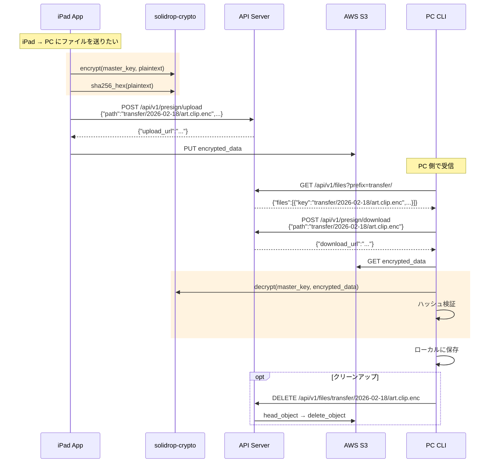
```mermaid
sequenceDiagram
    participant iPad as iPad App
    participant Crypto as solidrop-crypto
    participant API as API Server
    participant S3 as AWS S3
    participant PC as PC CLI

    Note over iPad: iPad → PC にファイルを送りたい

    rect rgb(255, 243, 224)
        iPad->>Crypto: encrypt(master_key, plaintext)
        iPad->>Crypto: sha256_hex(plaintext)
    end

    iPad->>API: POST /api/v1/presign/upload<br/>{"path":"transfer/2026-02-18/art.clip.enc",...}
    API-->>iPad: {"upload_url":"..."}
    iPad->>S3: PUT encrypted_data

    Note over PC: PC 側で受信

    PC->>API: GET /api/v1/files?prefix=transfer/
    API-->>PC: {"files":[{"key":"transfer/2026-02-18/art.clip.enc",...}]}

    PC->>API: POST /api/v1/presign/download<br/>{"path":"transfer/2026-02-18/art.clip.enc"}
    API-->>PC: {"download_url":"..."}
    PC->>S3: GET encrypted_data

    rect rgb(255, 243, 224)
        PC->>Crypto: decrypt(master_key, encrypted_data)
        PC->>PC: ハッシュ検証
    end

    PC->>PC: ローカルに保存

    opt クリーンアップ
        PC->>API: DELETE /api/v1/files/transfer/2026-02-18/art.clip.enc
        API->>S3: head_object → delete_object
    end
```

**前提:** iPad と PC は同じ Master Key を共有している（同一パスワードから導出）。

---

## 6. Presigned URL 書き換えメカニズム

Docker 環境でのネットワーク分離を解決するための仕組み。

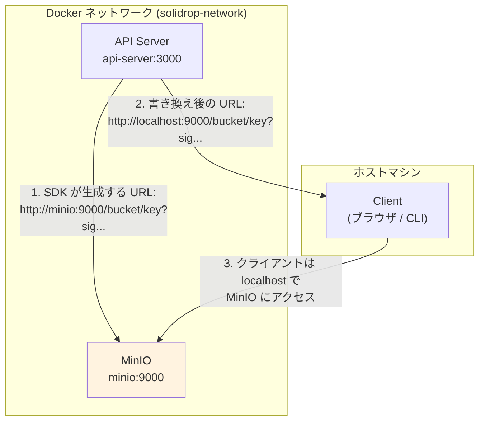
```mermaid
flowchart TD
    subgraph Docker["Docker ネットワーク (solidrop-network)"]
        API["API Server<br/>api-server:3000"]
        MinIO["MinIO<br/>minio:9000"]
    end

    subgraph Host["ホストマシン"]
        Client["Client<br/>(ブラウザ / CLI)"]
    end

    API -->|"1. SDK が生成する URL:<br/>http://minio:9000/bucket/key?sig..."| MinIO

    API -->|"2. 書き換え後の URL:<br/>http://localhost:9000/bucket/key?sig..."| Client

    Client -->|"3. クライアントは localhost で<br/>MinIO にアクセス"| MinIO

    style MinIO fill:#fff3e0
```

**書き換えロジック (`s3_client.rs`):**

```
条件: S3_ENDPOINT_URL と S3_PUBLIC_ENDPOINT_URL の両方が設定されている場合
処理: url.replace(S3_ENDPOINT_URL, S3_PUBLIC_ENDPOINT_URL)
例:   "http://minio:9000/..." → "http://localhost:9000/..."
```

**本番環境:** `S3_ENDPOINT_URL` を未設定にすれば書き換えは無効。AWS SDK が生成する S3 URL はそのまま公開アクセス可能。

---

## 7. エラーハンドリングフロー

### 7.1 エラー型とHTTPステータスのマッピング

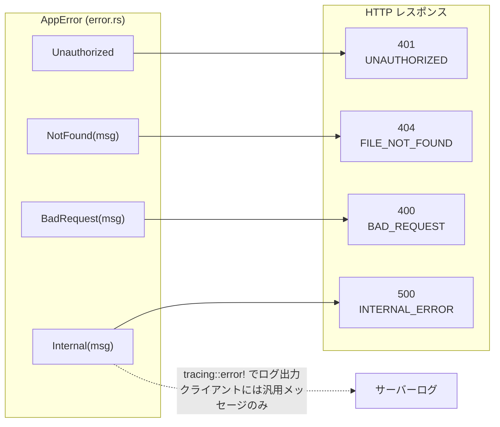
```mermaid
flowchart LR
    subgraph AppError["AppError (error.rs)"]
        Unauthorized["Unauthorized"]
        NotFound["NotFound(msg)"]
        BadRequest["BadRequest(msg)"]
        Internal["Internal(msg)"]
    end

    subgraph HTTP["HTTP レスポンス"]
        H401["401<br/>UNAUTHORIZED"]
        H404["404<br/>FILE_NOT_FOUND"]
        H400["400<br/>BAD_REQUEST"]
        H500["500<br/>INTERNAL_ERROR"]
    end

    Unauthorized --> H401
    NotFound --> H404
    BadRequest --> H400
    Internal --> H500

    Internal -.->|"tracing::error! でログ出力<br/>クライアントには汎用メッセージのみ"| Log["サーバーログ"]
```

**レスポンス形式 (全エンドポイント共通):**
```json
{
  "error": {
    "code": "FILE_NOT_FOUND",
    "message": "file not found: active/2026-02/art.clip.enc"
  }
}
```

`Internal` エラーのみ、詳細メッセージをクライアントに返さない（セキュリティ考慮）。

### 7.2 S3 エラーの判定フロー

```mermaid
flowchart TD
    S3Err["S3 SDK エラー発生"] --> IsSvcErr{"SdkError::ServiceError?"}

    IsSvcErr -->|Yes| CheckStatus{"HTTP status == 404?"}
    CheckStatus -->|Yes| NotFound["AppError::NotFound<br/>(ファイルが存在しない)"]
    CheckStatus -->|No (403, 500等)| Internal1["AppError::Internal<br/>(S3 サービスエラー)"]

    IsSvcErr -->|No| WhatKind{"エラー種別"}
    WhatKind -->|"DispatchFailure<br/>(接続失敗)"| Internal2["AppError::Internal"]
    WhatKind -->|"TimeoutError"| Internal3["AppError::Internal"]
    WhatKind -->|"その他"| Internal4["AppError::Internal"]
```

---

## 8. ローカル開発環境のデータフロー

### 8.1 Docker Compose サービス構成

```mermaid
flowchart TB
    subgraph compose["docker-compose.yml"]
        MinIO["minio<br/>minio/minio:latest<br/>:9000 (S3 API)<br/>:9001 (Web Console)"]
        Init["minio-init<br/>minio/mc:latest<br/>(ワンショット)"]
        API["api-server<br/>Rust binary<br/>:3000"]
    end

    MinIO -->|"healthcheck OK"| Init
    Init -->|"mc mb solidrop-dev<br/>(バケット作成)"| MinIO
    Init -->|"completed_successfully"| API

    Client["開発者 / テスト"] --> API
    Client --> MinIO

    style Init fill:#fff9c4
```

**起動順序:** MinIO (healthcheck) → minio-init (バケット作成) → api-server

### 8.2 テスト実行時のデータフロー

```mermaid
flowchart TD
    subgraph Tests["cargo test -p solidrop-api-server"]
        Unit["ユニットテスト<br/>(S3 不要)"]
        Integration["統合テスト<br/>(#[ignore], MinIO 必要)"]
    end

    subgraph UnitTargets["ユニットテスト対象"]
        CacheLogic["cache.rs<br/>LRU ソート・タイムスタンプ検証"]
        URLRewrite["s3_client.rs<br/>URL 書き換え"]
        AuthMW["api_test.rs<br/>認証ミドルウェア"]
    end

    subgraph IntegTargets["統合テスト対象 (MinIO 経由)"]
        Presign["presign upload/download"]
        ListFiles["ファイル一覧"]
        UploadList["upload → list 一連"]
        Delete404["delete 存在しないファイル"]
        Move["move 操作"]
        MoveEncoded["move (スペース入りキー)"]
        DeleteErr["delete S3エラー判定"]
    end

    Unit --> UnitTargets
    Integration --> IntegTargets
    IntegTargets --> MinIO["MinIO<br/>docker compose up"]

    style Unit fill:#c8e6c9
    style Integration fill:#fff9c4
```

| テスト種別 | 実行方法 | 件数 | 備考 |
|---|---|---|---|
| ユニット (常時実行) | `cargo test` | 9 | S3 接続不要 |
| 統合 (MinIO 必要) | `cargo test -- --ignored` | 8 | `docker compose up` 前提 |

---

## 9. セキュリティデータフロー

### 9.1 暗号化レイヤーの重畳

```mermaid
flowchart LR
    subgraph Layer1["Layer 1: アプリケーション層"]
        PT["平文"] -->|"AES-256-GCM<br/>(client-side)"| CT["暗号文"]
    end

    subgraph Layer2["Layer 2: トランスポート層"]
        CT -->|"TLS 1.3<br/>(HTTPS)"| TLS["TLS 暗号化された暗号文"]
    end

    subgraph Layer3["Layer 3: ストレージ層"]
        TLS -->|"SSE-S3<br/>(AWS managed)"| SSE["S3 ディスク上の暗号化"]
    end

    style Layer1 fill:#ffcdd2
    style Layer2 fill:#bbdefb
    style Layer3 fill:#c8e6c9
```

**各レイヤーの保護対象:**

| レイヤー | 保護対象 | 鍵の管理者 |
|---|---|---|
| AES-256-GCM | サーバー/クラウド侵害 | ユーザー本人のみ |
| TLS 1.3 | ネットワーク盗聴 | 証明書発行局 (Let's Encrypt) |
| SSE-S3 | AWS ディスク物理アクセス | AWS |

### 9.2 データの可視性マトリクス

| データ | クライアント | API Server | S3 | ネットワーク |
|---|---|---|---|---|
| 平文ファイル内容 | **可視** | 不可視 | 不可視 | 不可視 |
| 暗号文 | 可視 | 不可視 | **可視** | TLS 内 |
| Master Key | **可視** (Keychain) | 不可視 | 不可視 | 不可視 |
| ファイルパス / メタデータ | 可視 | **可視** | **可視** | TLS 内 |
| API Key | 可視 | **可視** (env var) | 不可視 | TLS 内 |
| IAM Credentials | 不可視 | **可視** (env var) | N/A | 不可視 |

---

## 10. 付録

### 10.1 SoliDrop 暗号化ファイルフォーマット

```
Offset  Size   Field          Description
──────  ─────  ─────────────  ─────────────────────────────
0x00    8      magic          "SOLIDROP\x01" (固定値)
0x08    1      version        0x01 (フォーマットバージョン)
0x09    16     salt           ファイル鍵導出用ソルト (CSPRNG)
0x19    12     nonce          AES-256-GCM ナンス (CSPRNG)
0x25    8      original_size  暗号化前のファイルサイズ (u64 LE)
0x2D    ...    ciphertext     AES-256-GCM 暗号文 + 認証タグ (16 bytes)
```

ヘッダサイズ: 45 bytes (0x2D)
認証タグ: 暗号文末尾の 16 bytes に含まれる

### 10.2 API エンドポイント一覧

| メソッド | パス | 認証 | S3 API コール | 用途 |
|---|---|---|---|---|
| `GET` | `/health` | 不要 | なし | ヘルスチェック |
| `POST` | `/api/v1/presign/upload` | 必要 | `put_object.presigned()` | アップロード URL 発行 |
| `POST` | `/api/v1/presign/download` | 必要 | `get_object.presigned()` | ダウンロード URL 発行 |
| `GET` | `/api/v1/files` | 必要 | `list_objects_v2` + N x `head_object` | ファイル一覧 |
| `DELETE` | `/api/v1/files/*path` | 必要 | `head_object` + `delete_object` | ファイル削除 |
| `POST` | `/api/v1/files/move` | 必要 | `copy_object` + `delete_object` | ファイル移動 |
| `POST` | `/api/v1/cache/report` | 必要 | なし | LRU 立退き候補算出 |

### 10.3 関連ドキュメント

| ドキュメント | パス | 内容 |
|---|---|---|
| PRD (要件定義) | `README.md` | 全要件・設計仕様 (日本語) |
| アーキテクチャ概要 | `docs/design/architecture.md` | システム構成・技術選定 |
| API Server 仕様 | `crates/api-server/SPEC.md` | エンドポイント詳細・設定・デプロイ |
| Crypto 仕様 | `crates/crypto/SPEC.md` | 暗号アルゴリズム・ファイルフォーマット |
| CLI 仕様 | `crates/cli/SPEC.md` | CLI コマンド・設定 |
| Terraform 仕様 | `infra/terraform/SPEC.md` | AWS リソース定義 |
| コードレビュー | `docs/progress/03-b-code-review-report.md` | 5件の指摘事項 |
| レビュー修正 | `docs/progress/04-review-fixes-report.md` | 指摘事項への修正報告 |
